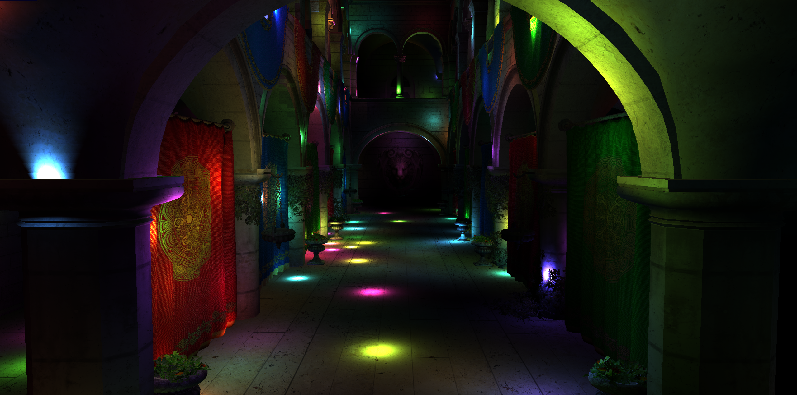
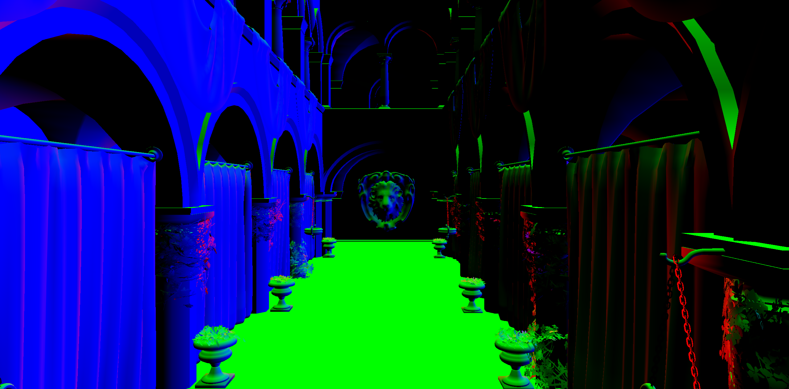
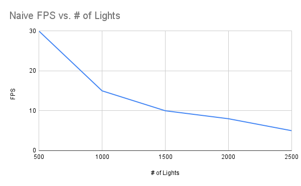
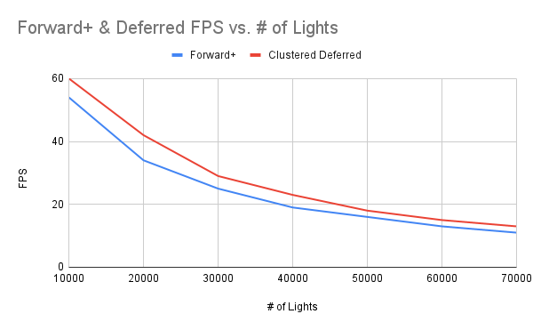

# WebGPU Forward+ and Clustered Deferred Shading

**University of Pennsylvania, CIS 565: GPU Programming and Architecture, Project 3**

- Bryce Joseph
- [LinkedIn](https://www.linkedin.com/in/brycejoseph/), [GitHub](https://github.com/brycej217)
- Tested on: Windows 11, Intel(R) CORE(TM) Ultra 9 275HX @ 2.70GHz 32.0GB, NVIDIA GeFORCE RTX 5080 Laptop GPU 16384MB

# CIS 5650 Project 4 - WebGPU Forward+ and Clustered Deferred Shading

This project involved creating a clustered lighting forward and deferred renderer in WebGPU. A clustered renderer takes the concept of dividing the view space into 3D volumes, then for each vertex, we should only light it with the lights which exist within that cluster. The project saw the lights of the scene being moved around in the space via a compute shader, and the determination of which clusters those lights fell into also being calculated using a compute shader. Given this lighting information, graphics passes were performed to light the affected geometry, one implementation with a typical forward pass, and another with a deferred pass.

Most of the conceptual understanding of this project and various implementation details came from this [blog](https://www.aortiz.me/2018/12/21/CG.html) by Angel Ortiz.

### Live Demo

### Demo Video/GIF

[]

## Clustering

Clustered lighting is the idea of dividing our view space into different 3D volumes. We can then determine which lights occupy that volume. Then for each vertex, we can determine which volume it falls into and light it with the lights that we had found to be in that volume. This is a much better alternative than naively iterating over the entire light list in the scene, especially when a scene contains a significant number of lights. For this implementation, we determine our x and y bounds by our screen space (pixel) coordinates, then for the z we perform logarithmic slicing according to the near and far planes of the view space. Essentially, this causes a higher concentration of slices closer to the view port, which leads to more effective buckets. Below is what my z slices ended up looking like:

To get our clusters, we run a compute shader per cluster index. Based on this index and the number of clusters we wish per axis, we can determine the minimum and maximum points of the axis-aligned bounding box that will represent the cluster. These aabb's are converted into view space. Based on this, we take a light's view space position, its radius, and perform a sphere-box intersection test to determine if it falls into the cluster. Then in our fragment shader, given a fragment position, we can determine which cluster it falls into, then calculate lighting based on those lights.

## Deffered Rendering

Deffered rendering is the concept of storing vertex information into textures before calculating lighting. In traditional forward renderes, lighting evaluation is done for all meshes as they are drawn, which can be wasted
computation if for example these meshes are drawn over. By instead writing separate information to different textures, we can perform a lighting pass on the fragments that will actually end up contributing to the final scene. For this renderer, world position, normals, and diffuse color we recorded and then finally used in a final lighting pass.

  
   
  

## Analysis

Analysis was performed on the Sponza scene, with point lights of radius 2.

First let's briefly discuss the naive implementation. This sees us looping over every light in the scene, which as we can see from the chart above, does not scale well, even with relatively low numbers of lights (from 500 to 2500). Quite clearly, and as we will see below, this implementation does not perform or scale well, and is essentially unable to even render the higher numbers of lights (10000 - 70000) that I will be using to compare the forward+ and deffered methods.

Now, we can see the forward+ vs deferred fps scaling with the number of lights. As we can see, the clustered deferred implementation performed the best, being an average of 16.82% faster across all iterations. This makes sense, as we are able to get rid of redundant lighting calculations with the deffered method, which is especially important in scenes with high light counts such as this. Now a potential reason for the performance decreases falling off as the number of lights increases is that we set a max light per cluster value, thus, it is likely that at high light counts, more clusters are reaching this maximum light count, which is why the performance dropoff fades.

Now a potential tradeoff for using a deffered implementation is the memory requirements. Here, we allocate a texture for each vertex attribute we wish to pass to the fragment shader, which in this case is only 3, but for other models like PBR, we could be passing in metallic, roughness, etc. In addition, memory access could introduce overhead, as in order to get our vertex attributes, we need to sample various textures. This could be a concern if the benefits from calculating lighting in a separate pass is not enough to offset the performance detriments of texture accessing. In this case, with tens of thousands of lights the performance gains we obtain from deferring lighting is worth it, but more often than not, most practical scenes will not contain this many lights.

A potential performance benefit added to this implementation in particular was how the cluster structs were set up. For my clusters, I simply had each one represented as an array of ints. Each index represened a cluster and each value represented the number of lights in the cluster. In my clustering compute shader, when I found a light that would intersect the cluster, I would add the index to a global light index list. By knowing the max number of lights per cluster, we can dtermine easily a cluster's offset into this global light list, and thus fetch the corresponding lights for each cluster accordingly. This implementation detail was again inspired by [Angel Orti's Blog](https://www.aortiz.me/2018/12/21/CG.html#part-2).

### Credits

- [Vite](https://vitejs.dev/)
- [loaders.gl](https://loaders.gl/)
- [dat.GUI](https://github.com/dataarts/dat.gui)
- [stats.js](https://github.com/mrdoob/stats.js)
- [wgpu-matrix](https://github.com/greggman/wgpu-matrix)
- [Angel Ortiz Blog](https://www.aortiz.me/2018/12/21/CG.html)
